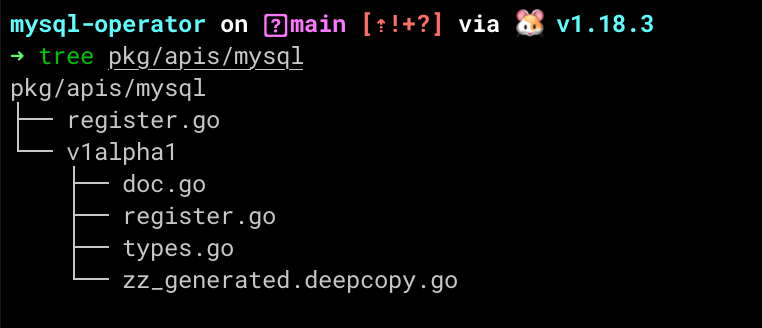

The project is designed to implement a K8s Operator with as few tools as possible and understand the K8s Operator core logic.

# How to write an MySQL Operator

1. Write CRD and register CR with kube-apiserver: [crd.yaml](./yaml/crd.yaml)
2. Write resource definitions through code:



3. Generate clients:
```
$ make build-resource
```
You may need to prepare the code generation tool by doing the following:
```shell
$ go get k8s.io/code-generator/cmd/defaulter-gen
$ go get k8s.io/code-generator/cmd/client-gen
$ go get k8s.io/code-generator/cmd/lister-gen
$ go get k8s.io/code-generator/cmd/informer-gen
$ go get k8s.io/code-generator/cmd/deepcopy-gen
```


4. Write controller and add event handlers to informer.

# Usage

```shell
# Register CR.
$ kubectl apply -f yaml/crd.yaml

# Build Operator.
$ make build-operator

# Run operator outside of Cluster.
$ ./release/operator -kubeconfig ~/.kube/config
```

